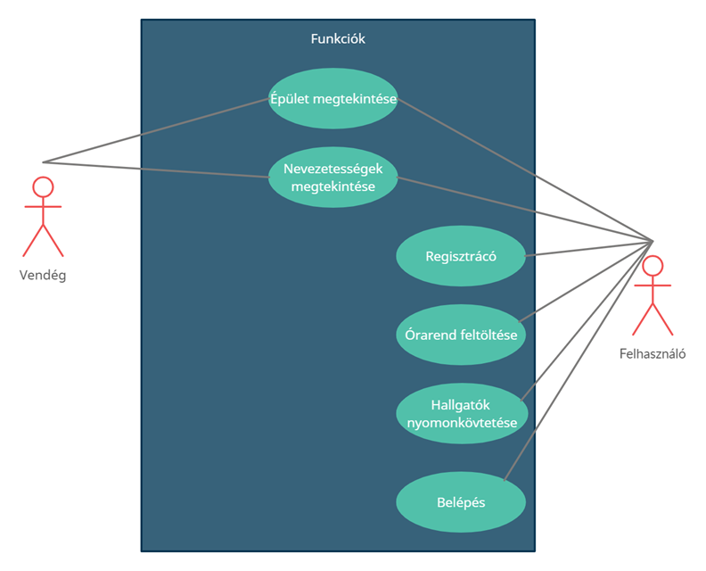

United Unies
=============

# Projekt leírása
Projektcél megfogalmazása
Olyan felületet szeretnénk létrehozni, amely a Pannon Egyetem hallgatói számára segítséget biztosít az egyetemi épületek közötti eligazodásban, valamint megtekinthetik, hogy éppen hol tartózkodnak hallgatótársaik. 

Egy regisztrációhoz kötött multiplatform oldal tervezése, majd kivitelezése a Pannon Egyetemen tanuló diákok számára. Az egyetem épületeinek, nevezetességeinek megjelenítése, valamint egyértelmű jelölése a térképen segítséget biztosít a tájékozódásban. Kiegészítésként feltölthetik majd a hallgatók az órarendjüket is.

A terv szerint a rendszer weboldalon működik majd, így minden platformról, eszközről elérhető lesz. Két típusú felhasználói módban lehet majd használni:

1.	Regisztrált felhasználó
2.	Vendég felhasználó

Felhasználók lehetőségei
A regisztrált felhasználók a Pannon Egyetem diákjai lehetnek, az ő számukra a platform funkciói korlátozások nélkül elérhetők. 
-	Órarend feltöltése a rendszerbe
-	Térképen az épületek megtekintése (Pannon Egyetem)
-	Az egyetem területén a nevezetességek megtekintése
-	Hallgatótársak követése (helyzetének megjelenítése a kampuszon belül)

Vendég felhasználók lehetnek azok a nem egyetemi hallgatók, akik az egyetem különböző rendezvényein részt vesznek (Pl. nyílt napok, versenyek, előadások) Természetesen az ő lehetőségeik korlátozottak. Megtekinthetik az egyetem területén lévő épületeket, valamint a nevezetességeket. 

Követelmények
 
Funkcionális követelmények
-	Regisztráció
-	Bejelentkezés
-	Órarend feltöltése
-	Épületek keresése

Nem funkcionális követelmények
-	Folyamatos nyomkövetés
-	Felhasználó adatainak mentése
 
Összegzés 
Az utóbbi időben több helymeghatározó applikáció is megjelent a piacon, illetve a social media felületei is biztosítják a barátaink, ismerőseink helyének meghatározását térképen. A mi célunk egy hasonló, helymeghatározó platform készítése kifejezetten a Pannon Egyetem hallgatói (vagy az egyetem által engedélyezett) számára. Az oldal segít a tájékozódásban, a diákok helyének meghatározásában és az órarend megtekintését leegyszerüsíti.

Használt porogramok:
----------------------
- Visual Sutido Code
- nhely.hu
- WampServer

Használt technológiák:
----------------------
- PHP
- Html
- Javascript
- CSS
- MySQL
